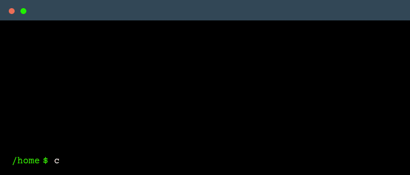

### Anton Nesterov
#### Full-stack software dev. Passionate. Experienced.
---
### Skills
- [x] Python - Jupyter, PyTorch, Django, Flask
- [x] NodeJS - TypeORM, AdonisJS, Express
- [x] Databases - PostgreSQL, MySQL, MongoDB
- [x] JavaScript - Vanilla, Svelte, Vue, Vuex
- [x] DevOps - Docker, Nomad, Bash, CI/CD (gitlab, onedev)

### Traits
- [x] Fast learner
- [x] Problem solver

<h4 class="text-center"> Contact me </h4>

 

